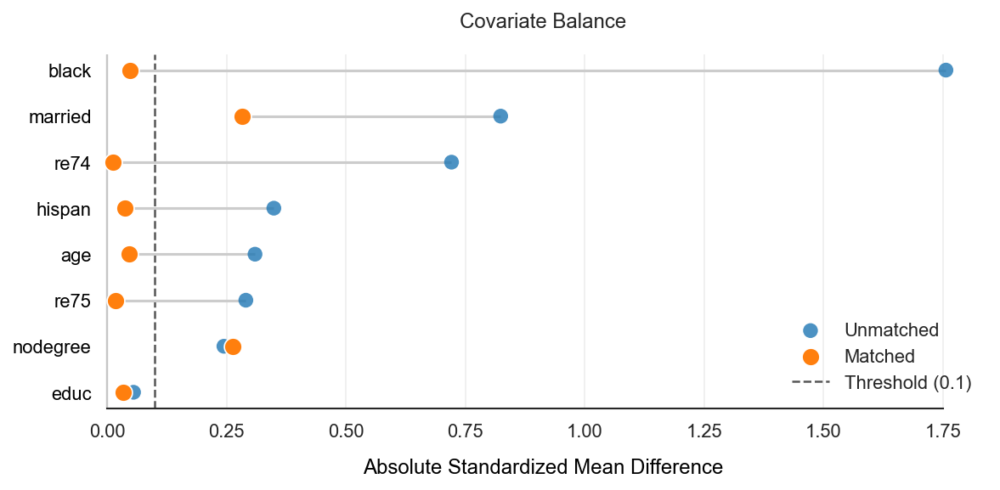
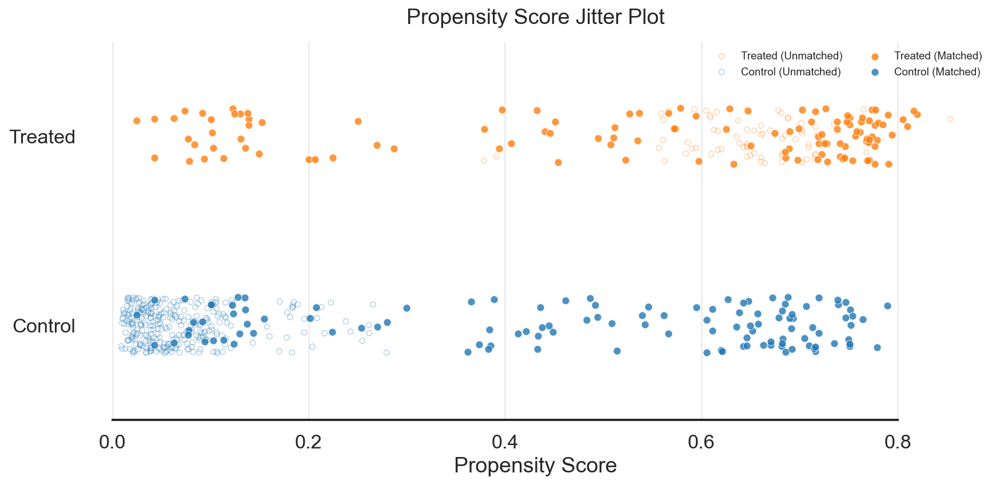
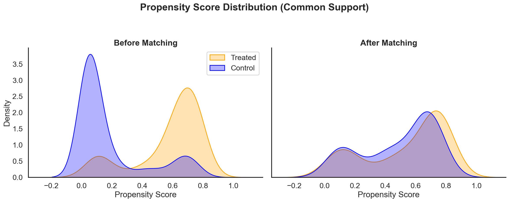

# pymatchit-causal: Propensity Score Matching in Python

[](https://doi.org/10.5281/zenodo.17839522)
[](https://badge.fury.io/py/pymatchit-causal)

**Scalable Causal Inference, Propensity Score Matching (PSM), and Coarsened Exact Matching (CEM).**

`pymatchit-causal` is a Python port of the standard R package `MatchIt`. It allows data scientists to preprocess data for causal inference by balancing covariates between treated and control groups using state-of-the-art matching methods. With the 0.5.0 release, it emphasizes a cohesive, publication-ready visual diagnostic suite.

## Why use pymatchit?
If you are looking for **Propensity Score Matching** in Python, this library provides a robust, "R-style" workflow including:
* **Propensity Score Estimation:** Logistic Regression (GLM), Random Forest, GBM, Neural Networks.
* **Matching Algorithms:** Nearest Neighbor (Greedy), Optimal Matching, Exact, Subclassification, Coarsened Exact Matching (CEM), Full Matching, Genetic Matching, and Cardinality Matching.
* **Diagnostics:** Publication-ready visual alignment—featuring Love Plots (Covariate Balance), Propensity Density Plots, ECDF plots, and the newly added **Jitter Plots** for intuitive match verification.

## Features
* **Matching Methods:** Nearest Neighbor, Optimal Matching, Exact, Subclassification, Coarsened Exact Matching (CEM), Full Matching, Genetic Matching, Cardinality Matching.
* **Distance Metrics:** Logistic Regression (GLM), Mahalanobis, Random Forest, GBM, Neural Networks, etc.
* **Diagnostics:** Cohesive diagnostic plots including visually aligned Love Plots, Jitter Plots, and Summary Tables (SMD, Variance Ratios).
* **Parity:** Designed to mirror the R `MatchIt` API (`matchit(formula, data, method=...)`).

---

## Installation

```bash
pip install pymatchit-causal
```

Dependencies: `numpy`, `pandas`, `scipy`, `statsmodels`, `matplotlib`, `scikit-learn`, `seaborn`, `patsy`.

---

## Example Workflow

**Scenario**: You have a dataset `healthcare_data.xlsx` with a binary treatment variable `took_drug`, an outcome `recovery_time`, and confounders like `age`, `severity`, and `income`.

### 1. Load Data
```python
import pandas as pd
from pymatchit import MatchIt

# Load your dataset
df = pd.read_excel("healthcare_data.xlsx")
```

### 2. Initialize and Match
We will use **Nearest Neighbor** matching using a **Random Forest** to estimate the propensity score, applying a **caliper** to ensure good matches.

```python
# Initialize the matching model
m = MatchIt(
    data=df,
    method='nearest',           # 1:1 Nearest Neighbor matching
    distance='randomforest',    # Use Random Forest for Propensity Scores
    distance_options={'n_estimators': 500},
    caliper={'distance': 0.1, 'age': 2},
    replace=False,
    random_state=42
)

# Fit the model using an R-style formula
m.fit("took_drug ~ age + severity + income + gender")
```

### 3. Assess Balance (Diagnostics)
Verify that the treatment and control groups are balanced with cohesive visualization tools.

```python
# 1. Statistical Summary
summary = m.summary()

# 2. Visual Inspection: Love Plot
m.plot(type='balance', threshold=0.1)
```


```python
# 3. Visual Inspection: Propensity Jitter Plot (New in 0.5.0!)
m.plot(type='jitter')
```


```python
# 4. Visual Inspection: Propensity Density Overlap
m.plot(type='propensity')
```


```python
# 5. Visual Inspection: ECDF Plot
m.plot(type='ecdf', variable='age')
```

### 4. Extract Matched Data
If balance is satisfactory, extract the data for analysis.

```python
# Get the final dataset containing only matched units
matched_df = m.matches(format='long') 

# Get data with weights and subclass
final_analysis_set = m.matched_data
```

### 5. Downstream Inference
Calculate cluster-robust standard errors in your final effect estimation:

```python
import statsmodels.formula.api as smf

model = smf.wls("recovery_time ~ took_drug", data=final_analysis_set, weights=final_analysis_set['weights'])
results = model.fit(cov_type='cluster', cov_kwds={'groups': final_analysis_set['subclass']})
print(results.summary())
```

---

---

## API Reference

### The `MatchIt` Class

```python
class MatchIt(
    data: pd.DataFrame,
    method: str = "nearest",
    distance: str = "glm",
    link: str = "logit",
    replace: bool = False,
    caliper: Union[float, Dict[str, float]] = None,
    ratio: int = 1,
    estimand: str = "ATT",
    exact: Union[str, List[str]] = None,
    subclass: int = 6,
    discard: str = "none",
    m_order: str = "largest",
    cutpoints: Dict = None,
    distance_options: Dict = None,
    random_state: int = None
)
```

#### Parameters

| Parameter | Type | Default | Description |
| :--- | :--- | :--- | :--- |
| **`data`** | `pd.DataFrame` | *Required* | The input dataset containing treatment, outcome, and covariates. |
| **`method`** | `str` | `"nearest"` | The matching algorithm to use. <br>• **`nearest`**: Nearest Neighbor (Greedy) matching. <br>• **`optimal`**: Optimal matching. <br>• **`exact`**: Exact matching. <br>• **`subclass`**: Subclassification (Stratification). <br>• **`cem`**: Coarsened Exact Matching. <br>• **`full`**: Full Matching. <br>• **`genetic`**: Genetic Matching. <br>• **`cardinality`**: Cardinality Matching. |
| **`distance`** | `str` | `"glm"` | The method used to estimate propensity scores or distance. |
| **`link`** | `str` | `"logit"` | The link function for the distance measure. |
| **`replace`** | `bool` | `False` | Whether to match with replacement. |
| **`caliper`** | `float`/`dict` | `None` | The maximum allowed distance between matches. |
| **`ratio`** | `int` | `1` | The number of control units to match to each treated unit. |

---

## Matching Methods Details

1.  **Nearest Neighbor (`method='nearest'`)**:
    * Greedy matching. Selects the closest control unit based on distance measure.
2. **Optimal Matching (`method='optimal'`)**:
    * Minimizes the global total distance across all matched pairs.
3.  **Exact Matching (`method='exact'`)**:
    * Matches units that have identical values for *all* covariates.
4.  **Subclassification (`method='subclass'`)**:
    * Divides the sample into subclasses (bins) based on propensity score quantiles.
5.  **Coarsened Exact Matching (`method='cem'`)**:
    * Coarsens continuous variables into bins (defined by `cutpoints`) and matches exactly on these coarsened bins.
6.  **Full Matching (`method='full'`)**:
    * Optimal subclassification that minimizes the globally calculated total distance within subclasses, where each subclass contains at least one treated and one control unit.
7.  **Genetic Matching (`method='genetic'`)**:
    * Uses a genetic/evolutionary algorithm to find optimal covariate weights that maximize balance between groups prior to matching.
8.  **Cardinality Matching (`method='cardinality'`)**:
    * Finds the largest possible subset of the data where treated and control groups satisfy user-specified balance constraints (on standardized mean differences).

---

## Citation

If you use `pymatchit-causal` in your research, please cite it:

> Tünnermann, J. (2026). pymatchit: Propensity Score Matching and Causal Inference in Python (Version 0.5.0). Zenodo. https://doi.org/10.5281/zenodo.17839522

**BibTeX:**
```bibtex
@software{pymatchit_causal,
  author       = {Jonas Tünnermann},
  title        = {pymatchit: Propensity Score Matching and Causal Inference in Python},
  year         = 2026,
  publisher    = {Zenodo},
  version      = {0.5.0},
  doi          = {10.5281/zenodo.17839522},
  url          = {https://doi.org/10.5281/zenodo.17839522}
}
```