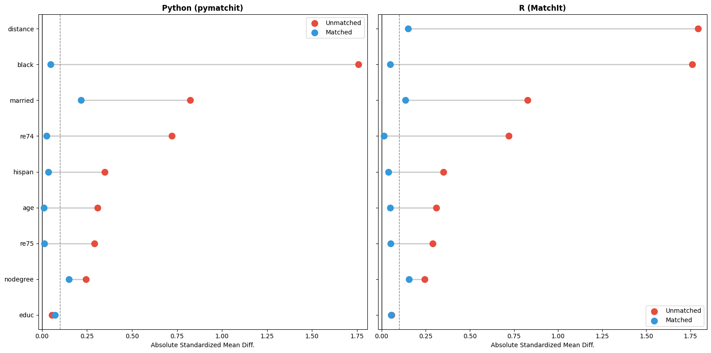

# Summary

`pymatchit-causal` is a Python library designed to preprocess observational data for causal inference by balancing covariates between treated and control groups. It implements Propensity Score Matching (PSM) and other matching techniques to reduce selection bias, mirroring the workflow of the widely standard R package `MatchIt` [@MatchIt:2011]. The library provides a familiar formula-based API (e.g., `treat ~ age + educ`) while leveraging the speed and ecosystem of Python's `scikit-learn` and `pandas`. The package is distributed via PyPI as `pymatchit-causal`. In the following we will refer to it as simply `pymatchit`.

# Statement of Need

In observational studies, estimating the causal effect of a treatment (e.g., a job training program) on an outcome (e.g., wages) is challenging because treated subjects often differ systematically from control subjects. Propensity Score Matching is a common technique to address this by constructing a "synthetic" control group that statistically resembles the treated group [@Rosenbaum:1983].

While R users have long relied on `MatchIt` for this task, the Python ecosystem has lacked a dedicated, unified library for matching that offers:
1.  **R-style Formula Syntax**: Allowing users to define causal relationships clearly and concisely.
2.  **Diverse Distance Metrics**: Beyond simple logistic regression, `pymatchit` supports modern machine learning estimators (Random Forest, Gradient Boosting, Neural Networks) via `scikit-learn` for robust propensity score estimation.
3.  **Standardized Diagnostics**: Generating "Love plots" (standardized mean difference plots) and Empirical Cumulative Distribution Function (ECDF) plots is critical for verifying balance but often requires writing extensive custom boilerplate code in Python.

`pymatchit` fills this gap, enabling data scientists to perform rigorous causal matching and balance assessment entirely within the Python environment without needing to switch languages.

# Functionality

The package is designed around a three-step workflow that separates design (matching) from analysis:

1.  **Estimation & Matching**: Users initialize a `MatchIt` object and fit a model using R-style formulas. The library calculates propensity scores and matches units using algorithms like Nearest Neighbor.
    ```python
    from pymatchit import MatchIt, load_lalonde
    
    # Load the standard Lalonde dataset
    df = load_lalonde()
    
    # Match using Nearest Neighbor with a Caliper
    # We use Logistic Regression (GLM) for the propensity score
    m = MatchIt(df, method='nearest', distance='glm', caliper=0.2)
    m.fit("treat ~ age + educ + race + married + nodegree + re74 + re75")
    ```

2.  **Diagnostics**: Users can immediately visualize covariate balance to ensure the matching procedure was successful.
    ```python
    # Generate Love Plot to check Standardized Mean Differences (SMD)
    m.plot(type='balance')
    
    # Check distributional balance using ECDF plots
    m.plot(type='ecdf', variable='age')
    ```

3.  **Analysis**: The matched dataset (with weights) can be extracted for downstream analysis.
    ```python
    # Return the matched dataset with a 'weights' column
    matched_data = m.matched_data
    ```

The package currently supports Nearest Neighbor, Exact, and Subclassification matching, utilizing the `scikit-learn` ecosystem for underlying distance estimation.

# Validation against R MatchIt

To ensure reliability, `pymatchit` was validated against the original R `MatchIt` package using the standard LaLonde dataset [@Lalonde:1986]. We performed a nearest-neighbor match (ratio=1, caliper=0.2) using logistic regression for propensity score estimation in both languages.

As shown in Figure 1, the covariate balance results—measured by Standardized Mean Differences (SMD)—are nearly identical. Both implementations successfully reduced the imbalance (red circles) to below 0.1 standard deviations (blue circles) for most covariates.



We further analyzed the specific units selected by the greedy matching algorithm (Figure 2). While there is substantial overlap (Green Xs, 89 units), there are minor discrepancies in unit selection (Orange circles vs. Blue crosses).


These discrepancies are expected and stem from minor floating-point differences between Python's `statsmodels` (used by `pymatchit`) and R's `glm` engine. In greedy nearest-neighbor matching, even a $10^{-8}$ difference in a propensity score can alter the sort order of units, causing the algorithm to pick a different "nearest" neighbor from a dense control pool. Despite these minor unit-level differences, the aggregate statistical balance achieved by `pymatchit` remains statistically equivalent to the R reference implementation.

# Acknowledgements

This project builds upon the methodological foundations laid by the authors of the R `MatchIt` package: Daniel Ho, Kosuke Imai, Gary King, and Elizabeth Stuart.

# References